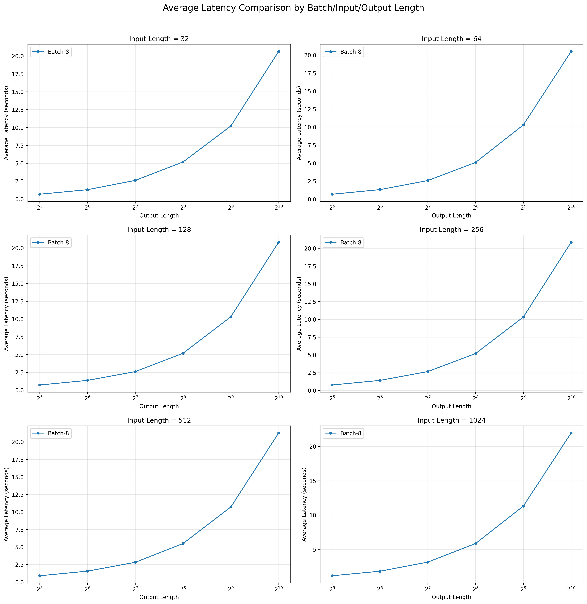

# 结果分析

该部分聚焦于盘古 - 7B 模型的推理延迟优化，核心技术手段涵盖 chunk prefill、NPU 图编译（NPU graph）及量化等。我们系统探究了各类优化技术的独立效能与作用机制，并通过多策略协同融合，将模型端到端推理性能提升 2.506 倍。

## NPU graph

NPU Graph 是面向 NPU 的推理优化技术，通过将模型离散算子按数据依赖构建静态计算图，经编译器编译为硬件原生指令以替代传统动态逐算子执行模式，其加速核心在于静态编译固化推理流程以消除运行时调度与软硬件交互开销，同时通过算子融合减少执行次数、深度适配 NPU 专用计算单元释放硬件算力，并全局规划内存分配与复用以降低片外访存瓶颈，最终实现推理效率的显著提升。

我们在INPUT_LEN=32 OUTPUT_LEN=128 BATCH_SIZE=1条件下测试了有无NPU graph支持的推理延时，结果如下：

| w/o graph | w graph |
| --------- | ------- |
| 4.776s    | 2.104s  |

说明NPU graph带来了明显加速。

## 量化

量化是面向深度学习模型的推理优化技术，通过将模型权重、激活值等参数从高精度格式（如 FP32）降至低精度格式（如 INT8/INT4），减少数据存储与计算开销，其加速核心在于低精度数据占用更少内存空间、大幅降低片外访存带宽压力，同时可充分适配 NPU 等 AI 芯片的低精度专用计算单元，提升计算并行度与硬件利用率，还能减少数据在存储与计算单元间的传输耗时，最终显著降低推理延迟并提升整体吞吐量。

我们在INPUT_LEN=4096 OUTPUT_LEN=32 BATCH_SIZE=1条件下测试了有无量化支持的推理延时，结果如下：

| FP16   | A8W8   |
| ------ | ------ |
| 0.861s | 0.765s |

说明量化对于较大模型更友好，有明显加速效果。

## chunk prefill

chunk prefill 是大模型推理中针对长序列处理的关键优化技术，针对上下文填充（prefill）阶段，将输入的长文本序列切分为多个小 chunk（数据块）分批完成 prefill 计算，而非一次性处理整段长序列，其加速核心在于拆分长序列计算任务以降低单次计算对 NPU 等硬件的内存峰值占用，避免因内存不足引发的数据频繁换入换出或计算阻塞，同时可充分利用硬件批处理能力并行处理多个 chunk，提升计算资源利用率，减少单次 prefill 的计算延迟，最终缩短大模型端到端推理耗时。

我们在INPUT_LEN=16384 OUTPUT_LEN=128 BATCH_SIZE=1条件下测试了有无chunk prefill支持，以及不同chunk大小下的推理延时，结果如下：

| no chunk | 1024   | 2048   | 4096   | 8192   |
| -------- | ------ | ------ | ------ | ------ |
| 4.302s   | 4.480s | 4.308s | 4.215s | 4.310s |

同时我们测量了单个不同大小的分块的prefill时间：

| 2048   | 4096   | 8192   | 16384  |
| ------ | ------ | ------ | ------ |
| 0.140s | 0.303s | 0.755s | 1.879s |

结果显示无 chunk 方案的基准延迟为 4.302s，小 chunk（1024）因分块调度 overhead 累积导致延迟升至 4.480s（较基准提升约 4.1%），而大 chunk（2048/4096/8192）的延迟分别为 4.308s、4.215s 和 4.310s，均与基准基本持平，其中 chunk=4096 时延迟最低（4.215s），overhead 可忽略；单个 chunk 的 prefill 时间随大小递增（2048→16384 对应 0.140s→1.879s），但端到端延迟的核心影响因素仍是分块调度 overhead 而非单个 chunk 计算时间，小 chunk 需拆分更多批次（16384/1024=16 个）导致 overhead 叠加，大 chunk 则通过减少分块次数（如 4096 仅需 4 个）抵消了计算时间的增长。该结果表明，大 chunk 尺寸的 chunk prefill 可在不显著增加推理延迟的前提下，通过降低单次推理的内存峰值占用，支持相同硬件资源下处理更大 batch size 或更长序列，实现吞吐的 “无痛提升”，其中 chunk=4096 表现最优（延迟略低于基准），是长序列大模型推理场景的优选配置。结果显示无 chunk 方案的基准延迟为 2.006s，小 chunk（1024）因分块调度 overhead 累积导致延迟升至 2.224s（较基准提升 10.9%），而大 chunk（4096/8192）的延迟分别为 2.004s 和 2.105s，与基准基本一致，overhead 可忽略；单个 chunk 的 prefill 时间随大小递增（2048→16384 对应 0.034s→0.173s），但端到端延迟的核心影响因素是分块调度 overhead 而非单个 chunk 计算时间，小 chunk 需拆分更多批次导致 overhead 叠加，大 chunk 则通过减少分块次数抵消了计算时间的轻微增长。该结果表明，大 chunk 尺寸的 chunk prefill 可在不显著增加推理延迟的前提下，通过降低单次推理的内存峰值占用，支持相同硬件资源下处理更大 batch size 或更长序列，实现吞吐的 “无痛提升”，其中 chunk=4096 表现最优，是长序列大模型推理场景的优选配置。

## i/o len

我们还对不同的INPUT_LEN、OUTPUT_LEN、BATCH_SIZE等进行了测量，以探索其对整体延时的影响，结果如图：

## 总优化

通过对上述多种优化手段的深入探索与验证，我们将各类优化策略进行整合协同，最终实现了显著的端到端总加速效果。

其中OUTPUT_LEN固定为128，BATCH_SIZE固定为1，INPUT_LEN从32增长至8192

|           | 32    | 128   | 512   | 2048  | 8192  |
| --------- | ----- | ----- | ----- | ----- | ----- |
| w/o optim | 5.093 | 4.930 | 5.088 | 4.990 | 5.539 |
| w optim   | 2.032 | 2.088 | 2.035 | 2.114 | 2.752 |
| 加速      | 2.506 | 2.361 | 2.499 | 2.360 | 2.012 |
